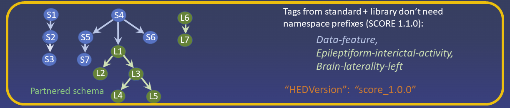
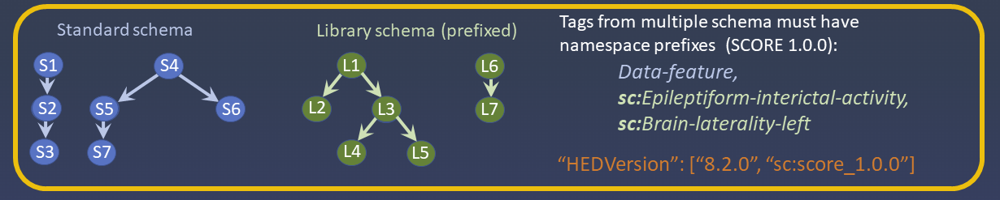

# HED schemas

## What is a HED schema?

HED (Hierarchical Event Descriptors) is an evolving framework for the description and
formal annotation of events and other types of data.
The HED ecosystem includes a structured vocabulary (specified by a HED schema)
together with tools for validation and for using HED annotations in data search,
extraction, and analysis.

A **HED schema** is a hierarchically-structured specification of a vocabulary.
The HED ecosystem includes a **standard schema** containing the basic vocabulary
needed for annotation of experimental data as well as specialized **library schemas** for
the additional field-specific terms needed to complete an annotation.

## Scope of HED

HED allows researchers to annotate what happened during an
experiment, including experimental stimuli and other sensory events, participant responses
and actions, experimental design, the role of events in the task, and the temporal structure
of the experiment. The resulting annotation is machine-actionable, meaning that it can be
used as input to algorithms without manual intervention. HED facilitates detailed comparisons
of data across studies.

As the name HED implies, much of the HED framework focuses on
associating metadata with the experimental timeline to make datasets analysis-ready and
machine-actionable. However, HED annotations and framework can be used to incorporate
other types of metadata into analysis by providing a common API (Application Programming
Interface) for building inter-operable tools.

## HED schema basics

HED annotations consist of unordered comma separated lists of HED tags.
The annotations may include parentheses to group terms that belong together.
For example in the HED annotation *Red, Triangle, Blue, Square*,
cannot use ordering to determine which tags belong together.
To indicate a red triangle and a blue square, you must use parentheses:
*(Red, Triangle), (Blue, Square)*.

### Tag hierarchy

The HED tags used to annotate data come from a controlled vocabulary
called a **HED schema**. A HED schema consists of a series of **top-level** tags representing
general categories in this vocabulary.
Each top-level tag is the root of a tree containing tags falling into that category.

Each child tag in a HED schema is considered to be a special type of its ancestors.
Consider the tag *Square*, which has a full schema path
*Item/Object/Geometric-object/2D-shape/Rectangle/Square*.
*Square* is-a type of *Rectangle*, which is-a type of *2D-shape*, etc.

The strict requirement of child **is-a** type of any ancestor
means that when downstream tools search for *2D-shape*,
the search will return tag strings containing *Square* as well as those
containing the tags *Rectangle* and *2D-shape*.

### Tag forms

When you tag, you need only use the tag node name (e.g, *Square*).
**HED-compliant tools** can convert between this "short-form" and the complete path or "long-form"
(e.g. */Item/Object/Geometric-object/2D-shape/Rectangle/Square*)
when needed for search, summarization, or other processing.

Rules for the HED schema vocabulary and for HED-compliant tools can be found in the
[**HED Specification**](https://www.hedtags.org/hed-specification/).

### Library schemas

**To avoid** uncontrolled expansion of the base HED vocabulary with specialized terminology,
HED supports the creation of library schemas, which are specialized vocabularies that can
be used in conjunction with the base schema to analyze specific aspects of interest.

To use a programming analogy, when programmers write a Python module, the resulting code
does not become part of the Python language or core library. Instead, the module becomes
part of a library used in conjunction with core modules of the programming language.
HED annotations may contain any combination of tags from the standard vocabulary and/or
HED library vocabularies.

Several library schemas are as described \[**below**\](#available-schemas.
Each library schema has its own directory under in the
[**hed-schemas**](https://github.com/hed-standard/hed-schemas) GitHub repository.

Each library schema version is now partnered with a specific
version of the standard schema. The library schema is merged
with its standard schema partner to form a unified schema
vocabulary as shown in:



Multiple library schemas can be used together, provided
they are partnered with the same standard schema and don't conflict.

It is also possible to use conflicting schemas together if you use
namespace designators as illustrated in:



In this case, both the version specification and the associated
annotations must have a xxx: namespace designator

## Viewing and accessing schemas

All versions of the HED schemas are located in the GitHub
[**hed-schemas**](https://github.com/hed-standard/hed-schemas)
and can be best-viewed using the [**HED schema browser**](https://www.hedtags.org/hed-schema-browser/).

## Available schemas

### The standard schema

The HED standard schema contains the basic vocabulary for annotating experiments.
These are terms that are likely to be useful in all types of annotations.
The HED standard schema source is located in the
[**standard_schema**](https://github.com/hed-standard/hed-schemas/tree/main/standard_schema)
directory of the [**hed-schemas**](https://github.com/hed-standard/hed-schemas) GitHub repository.

| Format     | Type                                                                                                                  | Use                                              |
| ---------- | --------------------------------------------------------------------------------------------------------------------- | ------------------------------------------------ |
| XML        | [**Raw**](https://raw.githubusercontent.com/hed-standard/hed-schemas/main/standard_schema/hedxml/HED8.4.0.xml)        | Accessed by tools for validation and analysis.   |
|            | [**Formatted**](https://github.com/hed-standard/hed-schemas/blob/main/standard_schema/hedxml/HED8.4.0.xml)            | Readable display.                                |
| MediaWiki  | [**Raw**](https://raw.githubusercontent.com/hed-standard/hed-schemas/main/standard_schema/hedwiki/HED8.4.0.mediawiki) | Edited to create a new schema.                   |
|            | [**Formatted**](https://github.com/hed-standard/hed-schemas/blob/main/standard_schema/hedwiki/HED8.4.0.mediawiki)     | Readable display for editing.                    |
| JSON       | [**Raw**](https://raw.githubusercontent.com/hed-standard/hed-schemas/main/standard_schema/hedjson/HED8.4.0.json)      | Used by AIs for easy lookup.                     |
| tsv        | [**Directory**](https://github.com/hed-standard/hed-schemas/tree/main/standard_schema/hedtsv/HED8.4.0)                | Spreadsheet representation.                      |
| Prerelease | [**Directory**](https://github.com/hed-standard/hed-schemas/tree/main/standard_schema/prerelease)                     | Working directory for developing the prerelease. |

### The SCORE library

The HED SCORE library is an implementation of the [**SCORE**](https://www.sciencedirect.com/science/article/pii/S1388245717309069) standard for clinical annotation of EEG by neurologists.
For more information and the latest references see
[**HED SCORE schema**](https://github.com/hed-standard/hed-schemas/blob/main/library_schemas/score/README.md).

| Format     | Type                                                                                                                               | Use                                              |
| ---------- | ---------------------------------------------------------------------------------------------------------------------------------- | ------------------------------------------------ |
| XML        | [**Raw**](https://raw.githubusercontent.com/hed-standard/hed-schemas/main/library_schemas/score/hedxml/HED_score_2.1.0.xml)        | Accessed by tools for validation and analysis.   |
|            | [**Formatted**](https://github.com/hed-standard/hed-schemas/blob/main/library_schemas/score/hedxml/HED_score_.1.0.xml)             | Readable display.                                |
| MediaWiki  | [**Raw**](https://raw.githubusercontent.com/hed-standard/hed-schemas/main/library_schemas/score/hedwiki/HED_score_2.1.0.mediawiki) | Edited to create a new schema.                   |
|            | [**Formatted**](https://github.com/hed-standard/hed-schemas/blob/main/library_schemas/score/hedwiki/HED_score_2.1.0.mediawiki)     | Readable display for editing.                    |
| JSON       | [**Raw**](https://raw.githubusercontent.com/hed-standard/hed-schemas/main/library_schemas/score/hedjson/HED_score_2.1.0.json)      | Used by AIs for easy lookup.                     |
| tsv        | [**Directory**](https://github.com/hed-standard/hed-schemas/tree/main/library_schemas/score/hedtsv/HED_score_2.1.0)                | Spreadsheet representation.                      |
| Prerelease | [**Directory**](https://github.com/hed-standard/hed-schemas/tree/main/library_schemas/score/prerelease)                            | Working directory for developing the prerelease. |

### The LANG library

The HED LANG library represents a vocabulary for annotating linguistic stimuli in language and other
types of experiments.
For more information and the latest references see
[**HED LANG schema**](https://github.com/hed-standard/hed-schemas/blob/main/library_schemas/lang/README.md).

| Format     | Type                                                                                                                             | Use                                              |
| ---------- | -------------------------------------------------------------------------------------------------------------------------------- | ------------------------------------------------ |
| XML        | [**Raw**](https://raw.githubusercontent.com/hed-standard/hed-schemas/main/library_schemas/lang/hedxml/HED_lang_1.1.0.xml)        | Accessed by tools for validation and analysis.   |
|            | [**Formatted**](https://github.com/hed-standard/hed-schemas/blob/main/library_schemas/lang/hedxml/HED_lang_1.1.0.xml)            | Readable display.                                |
| MediaWiki  | [**Raw**](https://raw.githubusercontent.com/hed-standard/hed-schemas/main/library_schemas/lang/hedwiki/HED_lang_1.1.0.mediawiki) | Edited to create a new schema.                   |
|            | [**Formatted**](https://github.com/hed-standard/hed-schemas/blob/main/library_schemas/lang/hedwiki/HED_lang_1.1.0.mediawiki)     | Readable display for editing.                    |
| JSON       | [**Raw**](https://raw.githubusercontent.com/hed-standard/hed-schemas/main/library_schemas/lang/hedjson/HED_lang_1.1.0.json)      | Used by AIs for easy lookup.                     |
| tsv        | [**Directory**](https://github.com/hed-standard/hed-schemas/tree/main/library_schemas/lang/hedtsv/HED_lang_1.1.0)                | Spreadsheet representation.                      |
| Prerelease | [**Directory**](https://github.com/hed-standard/hed-schemas/tree/main/library_schemas/lang/prerelease)                           | Working directory for developing the prerelease. |

## The HED community and resources

All HED-related source and documentation repositories are housed on the HED-standard
organization GitHub site, [**https://github.com/hed-standard**](https://github.com/hed-standard),
which is maintained by the HED Working Group. HED development is open-source and
community-based. The official HED website [**https://www.hedtags.org**](https://www.hedtags.org).

The HED Working Group invites those interested in HED to contribute to the HED ecosystem and development process.

HED schemas are community-driven. Users can contribute to existing schema or
propose the development of new schema by posting an
[**issue**](https://github.com/hed-standard/hed-schemas/issues) to the
[**hed-schemas**](https://github.com/hed-standard/hed-schemas) GitHub repository.

## HED schemas in BIDS

[BIDS](https://bids.neuroimaging.io/), which stands for Brain Imaging Data Structure,
is a widely-used standard that specifies how neuroimaging data should be organized.
HED is well-integrated into the BIDS standard.

The most common use case (for 99.9% of the HED users) is to use the standard
HED schema available on GitHub in the `standard_schema` directory of the
([https://github.com/hed-standard/hed-schemas/tree/main/standard_schema/hedxml](https://github.com/hed-standard/hed-schemas/tree/main/standard_schema/hedxml)).

````{admonition} **Example:** Using HED schema

```json
{
    "Name": "A wonderful experiment",
    "BIDSVersion": "1.10.1",
    "HEDVersion": "8.4.0"
}
```
````

Starting with BIDS version 1.8.0, BIDS allows the value associated with the
`"HEDVersion"` key in the `dataset_description.json` file to be a list rather
than a string expressing the HED version.
This allows the use of multiple, non-conflicting schemas to be specified.

````{admonition} **Example:** Using multiple non-conflicting schemas

```json
{
    "Name": "A wonderful experiment",
    "BIDSVersion": "1.10.1",
    "HEDVersion": ["score_2.1.0", "lang_1.1.0"]
}
```
````

Both `score_2.1.0` and `lang_1.1.0` are partnered with HED standard schema `8.4.0`,
meaning that their partnered standard schema is automatically included.
Since these library schemas do not conflict, they will be merged with `8.4.0` into a single
taxonomy tree, so the annotations do not require prefixes.

As library schemas are developed, every effort is made to keep them non-conflicting
and to release versions partnered with the latests standard schema.
For conflicting or non-partnered schemas, HED supports a prefix notation to allow
namespaces for conflicting schemas.

The following example specifies that the annotations in this dataset use HED standard schema
version 8.4.0, along with library schema `testlib` version 1.0.2.
Tags from the `testlib` schema library are to be prefixed with `la:` in annotations.

````{admonition} **Example:** Using conflicting schemas

```json
{
    "Name": "A wonderful experiment",
    "BIDSVersion": "1.10.1",
    "HEDVersion": ["8.4.0", "la:testlib_1.0.2"]
}
```
````

More details about HED schemas can be found in:
[**Library schemas**](https://www.hedtags.org/hed-specification/07_Library_schemas.html) in
the [**HED specification**](https://www.hedtags.org/hed-specification).

## HED schemas in NWB

NWB ([**Neurodata Without Borders**](https://nwb.org/)) is
another HED-supported standard and software ecosystem for
neurophysiology and behavioral data.

The HED version specifications for NWB are similar to those in BIDS.
HED's use in NWB is documented in the [**ndx-hed**](https://www.hedtags.org/ndx-hed/) extension documentation.
