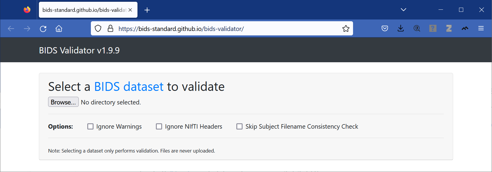
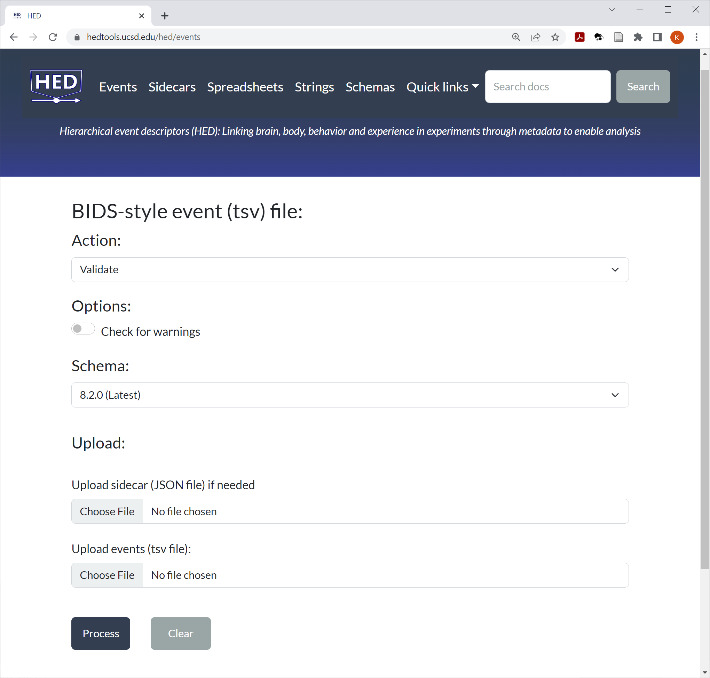

# HED validation guide

## What is HED validation?

HED validation is the process of checking the consistency and usage of HED annotations.

You should be sure to validate your data before applying analysis tools.
Most HED analysis tools, such as those used for searching, summarizing, or creating design matrices,
assume that the dataset and its respective event files have already been validated 
and do not re-validate during analysis.

This guide explains the types of errors that can occur and various ways that 
users can validate their HED (Hierarchical Event Descriptor) annotations.

## Types of errors

HED annotations consist of comma-separated lists of HED tags selected from
valid HED vocabularies, referred to as **HED schemas**.
HED annotations may include arbitrary levels of parentheses to clarify 
associations among HED tags.

In some cases, mainly in BIDS sidecars, HED annotations may contain `#` placeholders,
which are replaced by values from the appropriate columns of an associated event file 
when HED annotations are assembled for analysis. 

Two types of errors can occur: **syntactic** and **semantic**.

>**Syntactic** errors refer to format errors that aren't related to any particular HED schema,
>for example, missing commas or mismatched parentheses.

>**Semantic** errors refer to annotations that don't comply with the rules of the 
>particular HED vocabularies used in the annotation, for example, invalid HED tags 
>or values that have the wrong units or type.
>Semantic errors also include higher-level requirements such as missing definitions
>or unmatched *Offset* tags when designating the
>[**temporal scope**](https://www.hedtags.org/hed-specification/05_Advanced_annotation.html#temporal-scope) of events.

Current versions of the validators do not separate these phases and require that the appropriate
HED schemas are available at the time of validation.

See [**HED validation errors**](https:/www.hedtags.org/hed-specification/Appendix_B.html#b-1-hed-validation-errors)
for a list of the validation errors that are detected by validation tools.


## Available validators

HED currently supports native validators for Python and JavaScript.
Both validators support [**HED-specification v3.0.0**](https://raw.githubusercontent.com/hed-standard/hed-specification/master/hedspec/HEDSpecification_3_0_0.pdf).

### Python validator
The Python validator included in
[**HEDTools**](https://pypi.org/project/hedtools/) on PyPI is
used as the basis for most HED analysis tools.
Generally, new HED features are first implemented and tested in this validator
before propagating to other tools in the HED ecosystem.
The source code for HEDTools is available in the 
[**hed-python**](https://github.com/hed-standard/hed-python) GitHub repository.
The latest features appear on the `develop` branch before being propagated to `master`
and then released.

### JavaScript validator
The JavaScript [**hed-validator**](https://www.npmjs.com/package/hed-validator/v/3.7.0) on npm
is the package used for validation in [**BIDS**](https://bids.neuroimaging.io/).
Although the main interface is designed for BIDS integration,
the underlying validation functions can be called directly.
The source code is available in the
[**hed-javascript**](https://github.com/hed-standard/hed-javascript) GitHub repository.


### MATLAB support
Validation in MATLAB is currently not directly supported,
although some discussion about future native support is ongoing.
MATLAB users should use the [**HED online validation tools**](https://hedtools.org/hed/) 
or the [**HED RESTful services interface**](./HedOnlineTools.md#hed-restful-services)
as discussed [**below**](validation-for-matlab-users-anchor).


## Validation strategies

In most experiments, the event files and metadata sidecars share a common structure.
A practical HED approach is to annotate and validate a single events file and json sidecar using the online tools
before trying to validate entire dataset.
If most of the annotations are in a BIDS JSON sidecar,
this may be all you need to complete annotation.

``````{admonition} How to approach HED annotation.

1. Use the online tools to validate a single event file and sidecar if available.
2. Correct errors. (This will get most of the HED errors out.)
3. Use Jupyter notebooks or the remodeling tools to fully validate the HED in the dataset.
4. Use the BIDS validators to validate all aspects of the dataset, if the dataset is in BIDS.
``````

### Validation in BIDS

BIDS validates many aspects of a dataset beyond HED,
including the format and metadata for all the files in the dataset.
Thus, a dataset may have valid HED annotations but not be completely valid in BIDS.

#### Specifying the HED version
BIDS datasets that have HED annotations, should have the
`HEDVersion` field specified in `dataset_description.json` as 
illustrated in the following example:

````{admonition} Sample dataset_description.json for a BIDS dataset.
:class: tip

```json
{
    "Name": "Face processing MEEG dataset with HED annotation",
    "BIDSVersion": "1.8.4",
    "HEDVersion": "8.1.0",
    "License": "CC0"
}
```
````

#### BIDS online validator
The simplest way to validate a BIDS dataset is to use the BIDS
online validator:



The BIDS online validator is available at 
[**https://bids-standard.github.io/bids-validator/**](https://bids-standard.github.io/bids-validator/).
The BIDS validators use the [**hed-validator**](https://www.npmjs.com/package/hed-validator)
JavaScript package available at [**npm**](https://docs.npmjs.com/) to do the validation.

See the [**bids-validator**](https://github.com/bids-standard/bids-validator) for additional details.

(hed-online-validation-anchor)=
### HED online validation

The HED online validation tools are available at 
[**https://hedtools.org/hed/**](https://hedtools.org/hed/).
The HED web-based tools are designed to act on a single file (e.g. events, sidecar, spreadsheet, schema), but may require supporting files.

For example, the following screenshot shows the menu for the online event validation tools.
The buttons in the banner allow you to select the type of file to operate on.

Once you have selected the type by pressing the banner button,
you will see a menu for the particular type selected, in this case an events file.


*Menu for validating an events file using the HED online tools.*

The default action for events is validation,
but you can choose other operations by picking another action.
The validate operation has one option: whether to check for warnings as well as errors.

Upload the events file and the supporting JSON sidecar using the *Browser* buttons.
If you aren't using the latest HED vocabulary, you can use the *HED schema version*
pull-down to select the desired schema.

When you press the *Process* button, the files (event file and sidecar) are validated.
If the files have errors, a downloadable text file containing the error messages is returned.
Otherwise, a message indicating successful validation appears at the bottom of the screen.

The online tools support many other operations and most of them automatically
validate the files before applying the requested operation.
For example, one of the available actions shown on the menu above is 
assembling all the HED tags applicable to each line in the events file.

New features of the tools take a while to propagate to the released version of the online tools.
Use the [**HED online development server**](https://hedtools.org/hed_dev) to access the latest versions.


(validation-for-matlab-users-anchor)=
### Validation for MATLAB users

HED validation in MATLAB is currently done by accessing the HED online tools as web services.

#### Direct access to services
Users can access these services directly by calling wrapper functions or by using the HED MATLAB web services 
functions as explained in 
[**MATLAB HedTools**](./HedMatlabTools.md).
Download the [**hed-matlab**](https://github.com/hed-standard/hed-matlab) repository 
from GitHub and include the `hedmat` directory and its children in your MATLAB path.
The [**runAllDemos.m**](https://github.com/hed-standard/hed-matlab/blob/main/hedmat/web_services_demos/runAllDemos.m)
script calls all the services on test data.

#### Access through EEGLAB
[**EEGLAB**](https://sccn.ucsd.edu/eeglab/index.php) 
users can access HED validation through the
[**EEGLAB HEDTools plugin**](./HedAndEEGLAB.md).

[**CTagger**](./CTaggerGuiTaggingTool.md) is an annotation tool that
guides users through the tagging process using a graphical user interface.
CTagger is available as a stand-alone program as well from EEGLAB through
the HEDtools plugin.

#### Access through Fieldtrip

An interface for accessing HED in [**Fieldtrip**](https://www.fieldtriptoolbox.org/) has recently been added,
but is not yet fully documented.

### Validation for Python users

The [HEDTools](https://pypi.org/project/hedtools/) for Python are available on PyPI
and can be installed using the usual Python package installation mechanisms with PIP.
However, new features are not immediately available in the released version.
If you need the latest version you should install the `develop` branch
of the GitHub [**hed-python**](https://github.com/hed-standard/hed-python) repository
directly using PIP.

````{admonition} Installing the Python HedTools from the develop branch on GitHub.
:class: tip

```python
 pip install git+https://github.com/hed-standard/hed-python/@develop
 ```
 
 ````

#### Jupyter notebooks for validation

Several [**Jupyter notebooks**](https://github.com/hed-standard/hed-examples/tree/main/src/jupyter_notebooks) are available 
as wrappers for calling various Python HED tools. 

For example, the [**validate_bids_datasets.ipynb**](https://github.com/hed-standard/hed-examples/blob/main/src/jupyter_notebooks/bids/validate_bids_datasets.ipynb) notebook shown in the following example validates an entire BIDS dataset 
just give the path to the root directory of the dataset.

`````{admonition} Python code to validate HED in a BIDS dataset.
:class: tip

```python
import os
from hed.errors import get_printable_issue_string
from hed.tools import BidsDataset

## Set the dataset location and the check_for_warnings flag
check_for_warnings = False
bids_root_path = 'Q:/PerceptionalON'

## Validate the dataset
bids = BidsDataset(bids_root_path)
issue_list = bids.validate(check_for_warnings=check_for_warnings)
if issue_list:
    issue_str = get_printable_issue_string(issue_list, "HED validation errors: ", skip_filename=False)
else:
    issue_str = "No HED validation errors"
print(issue_str)

```
`````

Errors, if any are printed to the command line. 

(remodeling-summaries-for-validation-anchor)=
#### Remodeling validation summaries

Validation is also available through HED remodeling tool interface.
As explained in [**HED remodeling quickstart**](./HedRemodelingQuickstart.md),
the HED remodeling tools allow users to restructure their event files and/or
summarize their contents in various ways.
Users specify a list of operations in a JSON remodeling file,
and the HED remodeler executes these operations in sequence. 

Validation is a summary operation, meaning that it does not modify
any event files, but rather produces a summary, in this case of HED validation errors
for the dataset.
An example of a remodeling operation that is not a summary operation is
an operation to rename the columns in an event file.

The following example shows a JSON remodel file containing a single operation ---
validating event files.

`````{admonition} Example JSON remodel file for HED validation.
:class: tip

```json
[
    {
        "operation": "summarize_hed_validation",
        "description": "Validate event file and list errors in a summary.",
        "parameters": {
            "summary_name": "validate_initial",
            "summary_filename": "validate_initial",
            "check_for_warnings": true
        }
    }
]
```
`````

Since remodeling summaries do not affect the actual contents of the events files,
This summary can be created without using the backup infrastructure.

The following example performs HED validation on the BIDS dataset (*-b* option)
whose root directory is `/root_path`.
The remodeling file path (corresponding to the JSON in the previous example) is
also set.

`````{admonition} Example JSON remodel file for HED validation.
:class: tip

```python
import hed.tools.remodeling.cli.run_remodel as run_remodel

data_root = "/root_path"
model_path = "/root_path/derivatives/remodel/models/validate_rmdl.json"
args = [data_root, model_path, '-x', 'derivatives', 'stimuli', '-n', '', '-b', '-r', '8.1.0']
run_remodel.main(args)
```
`````

This remodeling action will perform HED validation on all the event
files in the specified BIDS dataset, excluding the `derivatives` and `stimuli` directories (*-x* option).
The event files and associated sidecars are located using the BIDS naming convention.

The results of the validation are stored in the file name specified in
the remodeling file in the `derivatves/remodel/summaries` directory
under the data root. A timestamp is appended to the file name each time
the operation is executed to distinguish files. 

Both a `.json` and a `.txt` file are created.
For example, the text file is:
`/root_path/derivatives/remodel/summaries/validate_initial_xxx.txt`
where xxx is the time of generation.

For more information see [**HED remodeling quickstart**](./HedRemodelingQuickstart.md)
for an overview of the remodeling process and
[**HED remodeling tools**](./HedRemodelingTools.md) for detailed descriptions of
the operations that are currently supported.
